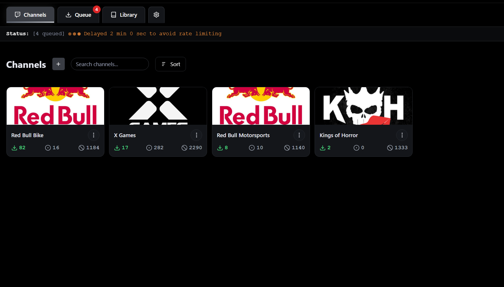
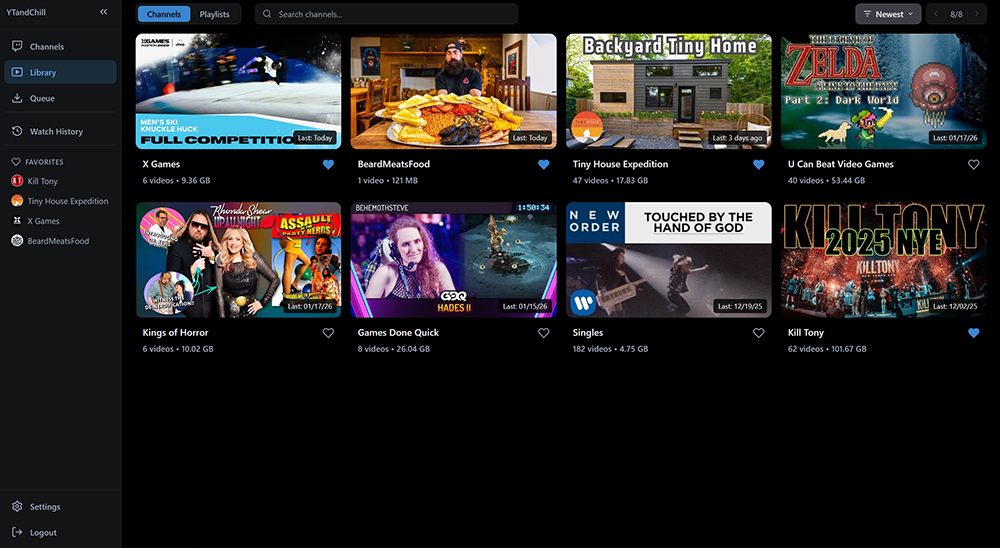
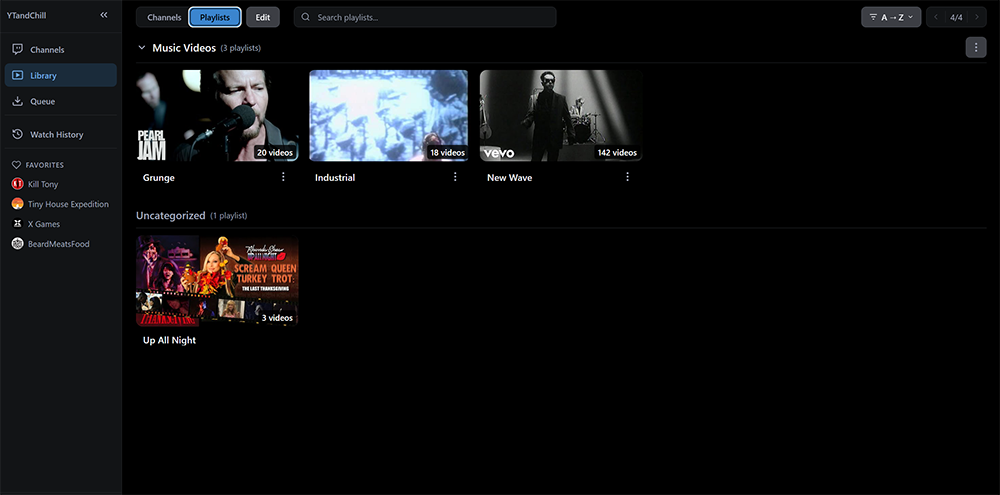
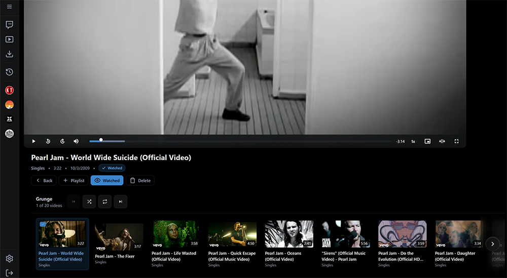
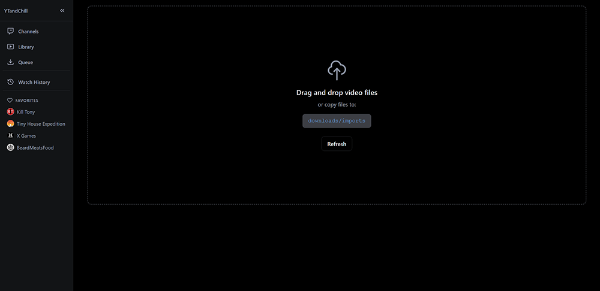
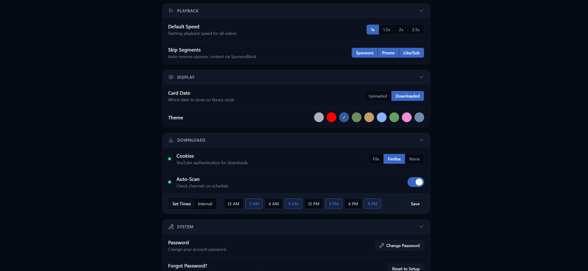
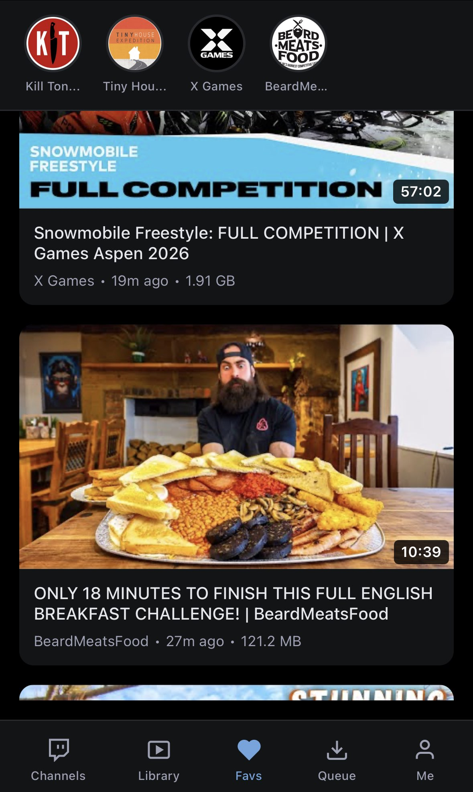

# YT and Chill

YouTube channel downloader and video library manager. Monitor channels, queue downloads, and manage your local video library. Built with [Claude AI](https://claude.ai) through months of collaborative prompting.


## Table of Contents

- [Features](#features)
- [Screenshots](#screenshots)
- [Quick Start](#quick-start)
- [Configuration](#configuration)
- [Importing Existing Videos](#importing-existing-videos)
- [Troubleshooting](#troubleshooting)
- [Documentation](#documentation)
- [Credits](#credits)

## Features

- **Channel Management** - Subscribe to channels, organize with categories, set per-channel duration filters and auto-download preferences
- **Smart Queue** - Drag-and-drop reordering, pause/resume, real-time progress with speed and ETA
- **Smart Import** - Drag-and-drop upload, auto-matching by filename or video ID, export results as Text/CSV
- **One-Off Downloading** - Download individual videos by URL without subscribing to channels
- **Playlists** - Create custom playlists, organize with categories, shuffle play
- **Video & Playlist Players** - Theater mode, playback speed controls, picture-in-picture, keyboard shortcuts
- **Settings with Themes** - 10 themes including Kernel, Fatal, Subnet, Archive, Buffer, Gateway, Catppuccin, Online, Pixel, Debug
- **Auto-Scan Scheduler** - Set daily scan times to automatically check for new uploads
- **Toast Notifications** - Non-blocking status updates throughout the app
- **Favorites** - Quick access to your favorite channels and their videos
- **Watch History** - Track watched videos with resume playback support
- **Mobile Support** - Touch-optimized interface with gesture controls
- **[SponsorBlock](https://sponsor.ajay.app/)** - Auto-skip sponsor segments, intros, outros, and self-promotions

## Screenshots

| Channels | Ignored Videos |
|:---:|:---:|
|  |  |

| Library | Playlist |
|:---:|:---:|
|  |  |

| Playlist Player | Import |
|:---:|:---:|
|  |  |

| Settings | Mobile |
|:---:|:---:|
|  |  |

## Quick Start

### Prerequisites

- Python 3.11+
- Node.js 18+
- ffmpeg (recommended)

### Installation

```bash
git clone https://github.com/thenunner/ytandchill.git
cd ytandchill
```

**Windows:**
```cmd
windows-start.bat
```
Select option 3 (Initial Setup) on first run, then option 1 (Start Server).

**Linux / macOS:**
```bash
chmod +x linux-start.sh
./linux-start.sh
```
Select option 3 (Initial Setup) on first run, then option 1 (Start Server).

**Unraid / Docker:**
See [UNRAID-SETUP.md](UNRAID-SETUP.md)

Access at **http://localhost:4099**

## Configuration

### YouTube Cookies (Recommended)

Required for reliable downloads due to YouTube's bot detection.

**Option 1: cookies.txt**
1. Install browser extension ("Get cookies.txt LOCALLY" for Chrome, "cookies.txt" for Firefox)
2. Export cookies from youtube.com while logged in
3. Save as `data/cookies.txt`
4. Select "cookies.txt" in Settings → Cookie Source

**Option 2: Firefox Integration (Docker only)**
1. Mount your Firefox profile directory in docker-compose.yml
2. Select "Firefox" in Settings → Cookie Source

See [FAQ.md](FAQ.md#youtube-cookies-and-authentication) for detailed cookie setup instructions.

### YouTube API Key (Optional)

A YouTube API key makes channel scanning significantly faster (~2 seconds vs ~2 minutes per channel).

1. Go to [Google Cloud Console](https://console.cloud.google.com/)
2. Create a project and enable **YouTube Data API v3**
3. Create an API Key under Credentials
4. Paste in Settings → Downloads → YouTube API Key

## Importing Existing Videos

Have existing YouTube videos? Import them into your library:

### Drag and Drop
1. Go to the Import page
2. Drag video files onto the page (supports files up to 50GB)
3. Click "Smart Import" to identify and add to library

### Direct Folder Access
1. Place video files in `downloads/imports/`
2. Go to Import page and click "Smart Import"

### Supported Formats
- **Web-ready:** `.mp4`, `.webm`, `.m4v` - import directly
- **Requires re-encoding:** `.mkv` - select "Include MKVs" option

### How Matching Works
- **Filename = Video ID** (e.g., `dQw4w9WgXcQ.mp4`) → instant match
- **Filename = Title** (e.g., `My Video Title.mp4`) → YouTube search + duration match

**Tip:** Add a `channels.txt` file with channel URLs (one per line) to improve matching accuracy.

## Troubleshooting

| Issue | Solution |
|-------|----------|
| Downloads failing | Update yt-dlp (`pip install --upgrade yt-dlp`), refresh cookies |
| Bot detection errors | Add or update cookies.txt - see [FAQ](FAQ.md#youtube-cookies-and-authentication) |
| Port already in use | Set `PORT` environment variable to a different port |
| Docker issues | Check logs with `docker logs ytandchill` |
| Slow channel scanning | Add YouTube API key in Settings |

For detailed troubleshooting, see [FAQ.md](FAQ.md).

## Documentation

| File | Description |
|------|-------------|
| [FAQ.md](FAQ.md) | Frequently asked questions and troubleshooting |
| [PLATFORM-GUIDE.md](PLATFORM-GUIDE.md) | Detailed platform-specific setup |
| [UNRAID-SETUP.md](UNRAID-SETUP.md) | Unraid/Docker installation guide |

## Credits

- [yt-dlp](https://github.com/yt-dlp/yt-dlp) - Video downloading
- [SponsorBlock](https://sponsor.ajay.app/) - Sponsor segment skipping
- [Flask](https://github.com/pallets/flask) - Backend framework
- [React](https://github.com/facebook/react) - Frontend framework
- [Video.js](https://github.com/videojs/video.js) - Video player
- [Tailwind CSS](https://github.com/tailwindlabs/tailwindcss) - Styling

## License

MIT License
