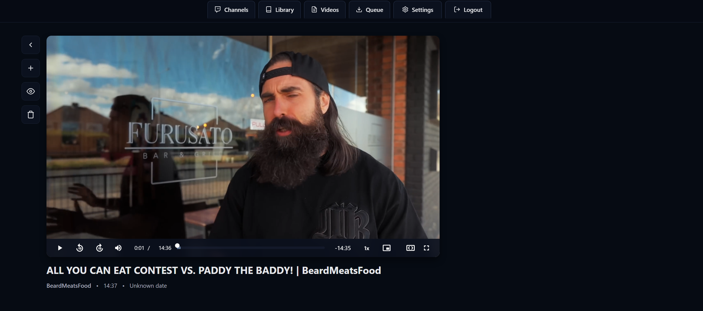

# YT and Chill

YT channel downloader and video library manager. Monitor channels, queue downloads, and manage your local YT video library with a modern web interface.

Coded mainly via countless sessions with AI.


## Table of Contents
- [Features](#features)
- [Screenshots](#screenshots)
- [Quick Start](#quick-start)
  - [Windows](#windows)
  - [Linux / macOS](#linux--macos)
  - [Unraid](#unraid)
- [Basic Configuration](#basic-configuration)
- [Usage](#usage)
- [Advanced Configuration](#advanced-configuration)
- [Troubleshooting](#troubleshooting)
- [Building from Source](#building-from-source)
- [Architecture](#architecture)
- [File Organization](#file-organization)
- [Additional Documentation](#additional-documentation)

## Features

- **Mobile & Tablet Touchscreen Support**: Full touch-optimized experience
  - Touch gestures: Swipe, tap, long-press for all interactions
  - Fullscreen video player with YouTube-style touch controls
  - Double-tap left/right to skip backward/forward 10 seconds
  - Volume and progress bar touch controls
  - Auto-hide controls in fullscreen mode
  - Responsive layouts optimized for phone and tablet screens
  - Touch-friendly buttons and spacing
  - Mobile-specific navigation and menus
  - Page state persistence across mobile browsing
- **Real-Time Progress Tracking**: Live download progress with speed, ETA, and percentage indicators
- **Scan Progress Indicators**: Real-time channel scanning progress with percentage completion
- **8 Custom Themes**: Choose from ash, chalk, rust, drift, bruise, ember, stain, and decay themes to personalize your interface
- **Auto-Refresh Scheduler**: Set daily scan times to automatically check for new videos from your subscribed channels, keeping your library up-to-date without manual intervention
- **Smart Duration Filters**: Set minimum and maximum video length preferences per channel to automatically filter out shorts, long streams, or any videos outside your preferred range
- **Channel Management**: Subscribe to YT channels and automatically track new uploads
- **Advanced Video Player**: Built-in player with automatic resume from last position, playback speed controls, and picture-in-picture support
- **Smart Downloads**: Queue-based download system with drag-and-drop reordering, pause/resume controls, and progress tracking
- **Playlist Support**: Create and organize custom playlists from your downloaded videos
- **Video Library**: Browse, search, and manage your downloaded videos with flexible filtering and sorting options
- **Cookie Authentication**: Support for YouTube cookies (strongly recommended for reliable downloads)
- **Session Persistence**: Remember login for 90 days (or 1 year with "Remember Me")
- **Sticky Status Bar**: Always-visible status bar at bottom with log panel (hidden on mobile phones)
- **Color-Coded Logs**: Real-time log messages with color-coded severity levels
- **First-Run Setup Wizard**: Easy initial username and password configuration

## Screenshots

### Channels View


### Library View


### Playlist View


### Video Player


## Quick Start

### Windows

**Prerequisites:**
- [Python 3.11+](https://www.python.org/) (check "Add Python to PATH" during install)
- [Node.js 18+](https://nodejs.org/)
- [ffmpeg](https://ffmpeg.org/) (optional but recommended)

**Installation:**

1. **Download the repository:**
   - **Option 1 (Download ZIP):** Click the green "Code" button at the top of this GitHub page, then click "Download ZIP". Extract the ZIP file to a folder of your choice (e.g., `C:\ytandchill`).
   - **Option 2 (Git Clone):** If you have Git installed, open Command Prompt or PowerShell and run:
     ```cmd
     git clone https://github.com/thenunner/ytandchill.git
     cd ytandchill
     ```

2. Open Command Prompt or PowerShell in the project folder
3. Run the setup script:
   ```cmd
   setup-native-windows.bat
   ```
4. Start the application:
   ```cmd
   start-native-windows.bat
   ```
5. Open http://localhost:4099 in your browser
6. Complete the first-run setup to create your username and password

### Linux / macOS

**Prerequisites:**

```bash
# Ubuntu/Debian
sudo apt install python3 python3-pip nodejs npm ffmpeg

# Fedora
sudo dnf install python3 python3-pip nodejs npm ffmpeg

# macOS (with Homebrew)
brew install python node ffmpeg
```

**Installation:**

1. **Download the repository:**
   - **Option 1 (Download ZIP):** Click the green "Code" button at the top of this GitHub page, then click "Download ZIP". Extract the ZIP file to a folder of your choice (e.g., `~/ytandchill`).
   - **Option 2 (Git Clone):** Open a terminal and run:
     ```bash
     git clone https://github.com/thenunner/ytandchill.git
     cd ytandchill
     ```

2. Run the setup script:
   ```bash
   chmod +x setup-native-linux.sh
   ./setup-native-linux.sh
   ```
3. Start the application:
   ```bash
   ./start-native-linux.sh
   ```
4. Open http://localhost:4099 in your browser
5. Complete the first-run setup to create your username and password

### Unraid

#### Option 1: Using Docker Template (Recommended)

1. Copy `ytandchill-template.xml` to `/boot/config/plugins/dockerMan/templates-user/`
2. Go to Docker tab in Unraid WebUI
3. Click "Add Container" and select "ytandchill"
4. Configure paths and port as needed
5. Click "Apply"
6. Access web interface at `http://YOUR-SERVER-IP:4099`
7. Complete the first-run setup to create your username and password

#### Option 2: Using Docker Compose

1. Copy the project to `/mnt/user/appdata/ytandchill/`
2. Run docker-compose:
   ```bash
   docker-compose up -d
   ```

See [UNRAID-SETUP.md](UNRAID-SETUP.md) for detailed Unraid installation instructions.

## Basic Configuration

### Directory Structure

The application uses the following directories (created automatically on first run):

```
ytandchill/
├── data/              # Database and configuration
├── downloads/         # Downloaded videos and thumbnails
├── logs/              # Application logs
└── cookies.txt        # YouTube cookies (optional but strongly recommended)
```

### Environment Variables

- `PORT`: Web interface port (default: 4099)
- `DATA_PATH`: Optional custom data directory location

### Optional: YouTube API and Cookies

For full functionality, you'll want to configure:
- **YouTube Data API v3 key** (required for channel scanning)
- **YouTube cookies** (strongly recommended for reliable downloads)

These can be configured through the Settings page after initial setup. See [Advanced Configuration](#advanced-configuration) for detailed instructions.

## Usage

### Getting Started

1. **Add Channels**: Navigate to the Channels page and add YT channel URLs
2. **Browse Library**: View all tracked channels and playlists
3. **Queue Downloads**: Select videos to download from channel pages
4. **Watch Videos**: Access your downloaded library through the Library tab

### Settings Configuration

Navigate to **Settings** to configure the following:

#### YouTube Data API Key

The YouTube Data API v3 key is required for channel scanning and fetching video metadata. See the [Advanced Configuration](#advanced-configuration) section for setup instructions.

#### Auto-Scan Daily

Enable automatic channel scanning to keep your library up-to-date without manual intervention.

**How it works:**
- Set a specific time (hour and minute) for automatic channel scans
- Toggle ON/OFF to enable or disable auto-scanning
- When enabled, YT and Chill will automatically check all your subscribed channels for new videos at the scheduled time each day
- New videos are added to your library for review - you can then download or ignore them

**Setup:**
1. Go to **Settings** → **Auto-Scan Daily**
2. Select the hour and minute for daily scans (e.g., 03:00 AM)
3. Toggle the switch to **ON**
4. The system will automatically scan all channels at the scheduled time

**Best Practices:**
- Schedule scans during off-peak hours (e.g., early morning)
- With the free API tier (10,000 quota units/day), you can scan ~100-300 channels daily
- Monitor your API usage if you have many channels

#### Cookies.txt

As of 2024, YouTube cookies are essential for reliable downloads. See the [Advanced Configuration](#advanced-configuration) section for setup instructions.

#### Reset User (Password Management)

The **Reset User** button allows you to change your login credentials for the YT and Chill web interface.

**How to use:**
1. Go to **Settings** → **Password** section
2. Click "Reset User"
3. Enter your current password
4. Enter a new username (minimum 3 characters)
5. Enter and confirm your new password (minimum 3 characters)
6. Click "Save New Credentials"

**Important:**
- You'll be logged out and need to log in again with your new credentials
- Make sure to remember your new username and password
- There is no password recovery - if forgotten, you'll need to access the backend to reset manually

#### Theme Selection

Choose from 8 different color themes to customize your interface:

**Row 1:** ash (dark gray), chalk (light mode), rust (red), drift (blue)
**Row 2:** bruise (purple), ember (orange), stain (yellow), decay (green)

Simply click on any theme button to apply it immediately. Your theme preference is saved automatically.

## Advanced Configuration

### YouTube API Setup (Required for Channel Scanning)

YT and Chill requires a YouTube Data API v3 key to scan channels and fetch video information:

1. Go to [Google Cloud Console](https://console.cloud.google.com/)
2. Create a new project (or select existing)
3. Enable the **YouTube Data API v3**:
   - Go to "APIs & Services" → "Library"
   - Search for "YouTube Data API v3"
   - Click "Enable"
4. Create credentials:
   - Go to "APIs & Services" → "Credentials"
   - Click "Create Credentials" → "API Key"
   - Copy your API key
5. In YT and Chill web interface:
   - Navigate to **Settings**
   - Paste your API key in the "YouTube API Key" field
   - Click "Save"

**Note**: The free tier provides 10,000 quota units per day, which is sufficient for personal use (scanning ~100-300 channels daily).

### YouTube Cookies (Strongly Recommended for Downloads)

**As of 2024, YouTube cookies are essentially required for reliable downloads.** According to [yt-dlp's FAQ](https://github.com/yt-dlp/yt-dlp/wiki/FAQ#how-do-i-pass-cookies-to-yt-dlp), YouTube has implemented increasingly aggressive bot detection, making downloads fail without authentication cookies. While technically optional, you'll likely encounter frequent download failures without them.

To provide YouTube authentication cookies:

**Method 1: Browser Extension (Recommended)**
1. Install a cookie export extension:
   - Chrome/Edge: "Get cookies.txt LOCALLY"
   - Firefox: "cookies.txt"
2. Go to youtube.com and ensure you're logged in
3. Click the extension icon and export cookies for youtube.com
4. Save the exported file as `cookies.txt` in the project directory
5. Restart the container

**Method 2: Manual Export**
1. Open browser DevTools (F12)
2. Go to youtube.com (logged in)
3. Navigate to Application → Cookies → youtube.com
4. Export cookies in Netscape format
5. Save as `cookies.txt`

**Important**:
- The cookies.txt file must be in Netscape HTTP Cookie File format
- Cookies expire periodically - if downloads start failing, re-export your cookies
- Never share your cookies.txt file (it contains your authentication)
- **Use a disposable YouTube account**, NOT your personal account (see [FAQ.md](FAQ.md) for account safety recommendations)
- **Without cookies, you may experience**: bot detection errors, rate limiting, and failed downloads even for public videos

**For detailed export instructions and troubleshooting**, see the [FAQ (Frequently Asked Questions)](FAQ.md).

## Troubleshooting

### Windows/Linux/macOS (Native)

**Application won't start:**
- Check Python version: `python --version` (need 3.11+)
- Check Node version: `node --version` (need 18+)
- Ensure ffmpeg is installed: `ffmpeg -version`
- Check logs in `logs/app.log`

**Port already in use:**
- Another service is using port 4099
- Change port in `backend/app.py` (line with `port = int(os.environ.get('PORT', 4099))`)

**Downloads failing:**
- Update yt-dlp: `pip install --upgrade yt-dlp`
- Check internet connection
- Check logs for specific errors
- See [FAQ.md](FAQ.md) for common yt-dlp errors

**Can't access age-restricted videos:**
- Ensure cookies.txt is properly formatted (Netscape format)
- Re-export cookies if they've expired
- Restart application after adding cookies

### Unraid (Docker)

**Container won't start:**
- Check logs: `docker logs ytandchill`
- Verify volume paths exist and have correct permissions (99:100)
- Ensure port 4099 is not in use

**Force update not working:**
- Manually pull: `docker pull ghcr.io/thenunner/ytandchill:latest`
- Restart container from Unraid Docker tab

**For more troubleshooting help**, see [FAQ.md](FAQ.md) and [PLATFORM-GUIDE.md](PLATFORM-GUIDE.md).

## Building from Source

### For Windows/Linux/macOS (Native)

The setup scripts handle everything automatically. To manually rebuild:

**Frontend:**
```bash
cd frontend
npm install
npm run build
```

**Backend:**
```bash
cd backend
pip install -r requirements.txt
```

### For Unraid (Docker)

Pre-built images are available from GitHub Container Registry:
```bash
docker pull ghcr.io/thenunner/ytandchill:latest
```

Or build locally:
```bash
docker-compose build
```

## Architecture

- **Frontend**: React + Vite + Tailwind CSS
- **Backend**: Python + Flask
- **Downloader**: yt-dlp
- **Database**: SQLite
- **Video Processing**: ffmpeg

## File Organization

### Setup Scripts
- `setup-native-windows.bat` - Windows setup
- `setup-native-linux.sh` - Linux/Mac setup
- `start-native-windows.bat` - Start on Windows
- `start-native-linux.sh` - Start on Linux/Mac

### Unraid Docker Files
- `docker-compose.yml` - Unraid docker-compose configuration
- `ytandchill-template.xml` - Unraid Docker template
- `build-for-unraid.sh` - Build script for Unraid

## Additional Documentation

- **[FAQ (Frequently Asked Questions)](FAQ.md)** - Common issues, errors, and troubleshooting
  - YouTube cookies and authentication (detailed export instructions)
  - Common yt-dlp errors (geo-blocking, bot detection, etc.)
  - Download failures and performance issues
  - Account safety recommendations
  - Storage and backup questions
- **[Platform Guide](PLATFORM-GUIDE.md)** - Detailed platform-specific instructions
  - Windows, Linux, macOS, and Unraid setup
  - Auto-start configuration for each platform
  - Platform-specific troubleshooting
  - Common maintenance tasks
- **[Unraid Setup Guide](UNRAID-SETUP.md)** - Detailed Unraid Docker instructions

## License

MIT License - feel free to use for personal projects

## Credits

- Built with [yt-dlp](https://github.com/yt-dlp/yt-dlp)
- Icons from [Dashboard Icons](https://github.com/walkxcode/dashboard-icons)

## Support

For issues and feature requests, please open an issue on GitHub.
